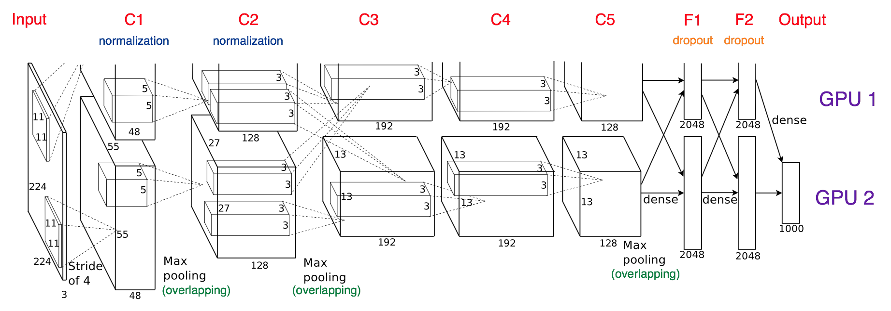
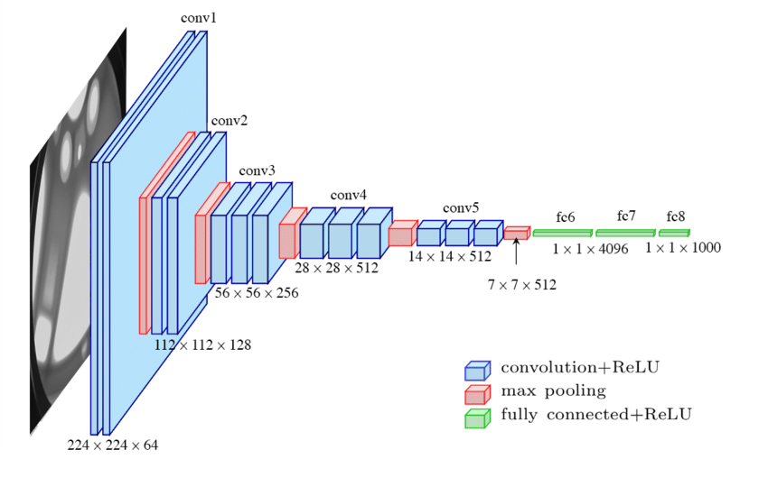
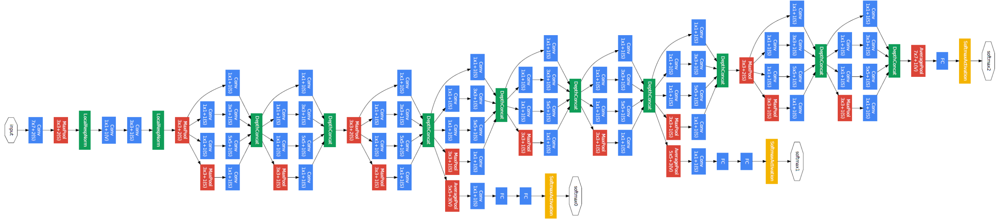
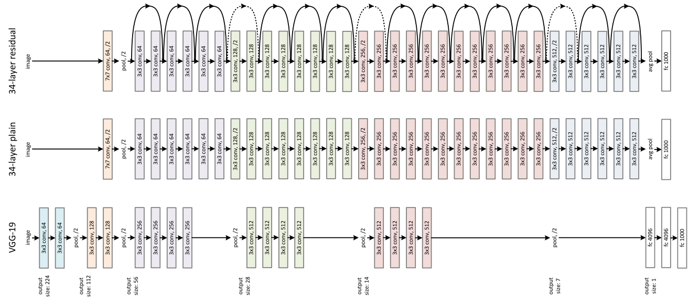

# [A Survey of Modern Deep Learning based Object Detection Models](https://arxiv.org/abs/2104.11892)

Object detection is the problem of identifying objects pertaining to a predefined class in an image, and specifying their location in the overall image via a bounding box.

### Challenges

1. Intra class variation. Factors like lighting, position, shape, etc. have a massive overall effect on the raw greyscale pixel values. Implementing rigidity to account for this problem has proved to be extremely hard in an acceptable algorithmic complexity. 
2. Number of categories. Additional categories exponentially add to complexity. Figuring out how to use less complexity, or better yet, less sample data, is an important research question. 
3. Efficiency. High computational resources required for any remotely accurate detection results.

### Metrics

Common criteria include:

- FPS
- Precision
- Recall

But the most popular is Average Precision ($mAP$). Precision is derived from Intersection over Union (IoU) which is the ratio of the area of overlap and the area of union between the ground truth and the predicted bounding box. Precision measures the percentage of correct predictions while the recall measure the correct predictions with respect to the ground truth. Precision is computed for each individual class, the mean average of all classes is used as the metric for final evaluation.

$$Precision = {True\ Positive\over{All\ Observations}}\\Recall = {True\ Positive\over{All\ Ground\ Truth}}$$

### Backbone architectures

These networks are employed to extract features from input images trained on by the model.

**AlexNet**

**VGG**

**GoogLeNet/Inception**

**ResNet**

### Object detectors

**Two-stage**

These models aim to find an arbitrary number of object proposals during phase 1, then proceed to classify and localize them in phase 2. As a result, they're typically more computationally inefficient

**Single-stage**

Classify and localize semantic objects in a single shot using dense sampling. Leverage predefined boxes of various scale & aspect ratio to localize objects. 

[[R-CNN]]