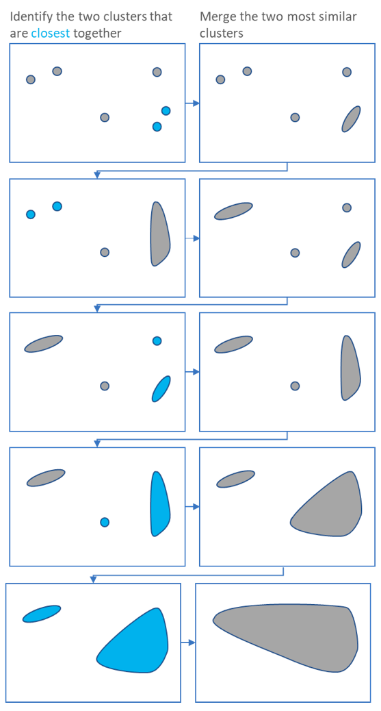

[Selective Search for Object Detection (C++ / Python)](https://learnopencv.com/selective-search-for-object-detection-cpp-python/)
[Selective Search for Object Recognition](http://www.huppelen.nl/publications/selectiveSearchDraft.pdf)


### Object recognition considerations
- **Capture all scales**: images will contain objects of varying size and shapes, encapsulating all of them is critical to accurate representations.
- **Diversification**: There's no absolute optimal strategy to clump region proposals together. Factors like colour, brightness, texture, etc. affect how local regions form an object within an image.
- **Speed of computation**: Ideally we'd be able to rely on a method as powerful as exhaustive search, but in reality we have a limited amount of computational resources and must stay within a reasonable limit.

## Selective Search by Hierarchical Grouping
A bottom-up hierarchical grouping (clustering) algorithm forms the basis of this implementation. Due to the fact that grouping itself is a hierarchical task, we can generate locations at all scales by simply extending the recursive nature of the algorithm until it's reached the full image scale.



To obtain an initial set of small feature regions - which is analogous of the initial dots in the diagram above, we'll use Felzenszwalb and Huttenlocher's [[Efficient Graph-Based Image Segmentation]] algorithm. Our approach can now be detailed as
```
Input: (colour) image  
Output: Set of object location hypotheses L

Obtain initial regions R = {r1,··· ,rn} using EGBIS
Initialise similarity set S = 0
foreach Neighbouring region pair (ri,rj) do
	Calculate similarity s(ri,rj) 
	S = S∪s(ri,rj)

while S ≠ 0 do  
	Get highest similarity s(ri, rj) = max(S)  
	Merge corresponding regions rt = ri∪rj  
	Remove similarities regarding ri : S = S\s(ri, r∗)
	Remove similarities regarding rj : S = S\s(r∗,rj)
	Calculate similarity set St between rt and its neighbours
	S=S∪St  
	R=R∪rt

Extract object location boxes L from all regions in R

```

## Diversification Strategies
Our criterion for determining similar proposals is based on employing:
1. Varying colour spaces with different invariance properties
2. Different similarity measures $s_{ij}$
3. Varying starting regions

### Complementary Similarity Measures
$s_{colour}(r_i, r_j)$: Obtain 1-D colour histogram for each colour channel. The histograms are normalized via $L_1$ norm. Similarity is computed via the intersection
$$s_{colour}(r_i,r_j)=\sum_{k=1}^nmin(c_i^k, c^k_j)$$
The histograms are efficiently propogated through the hierarchy by
$$C_t = \frac{size(r_i)\times{C_i}+size(r_j)\times{C_j}}{size(r_i)+size(r_j)}$$

$s_{texture}(r_i, r_j)$: Textures can be represented using fast SIFT-like measurements. Gaussian derivatives in 8 orientations are taken using $\sigma=1$ for each colour channel. For each orientation, we extract a histogram. Then, similarity can be computed by the histogram intersection:
$$s_{texture}(r_i,r_j)=\sum_{k=1}^nmin(t_i^k, t_j^k)$$

$s_{size}(r_i, r_j)$: Encourage small regions to merge early. This is key beause it ensures that objects of all scales are detected throughout the image. More rigorously, it is defined as:
$$s_{size}(r_i,r_j)=1-\frac{size(r_t)+size(r_j)}{size(im)}$$

$s_{fill}(r_i, r_j)$: Measure how well $r_i$ and $r_j$ fit into each other. This allows for filling gaps as nested regions should be merged immediately to avoid holes.

$$fill(r_i, r_j)=1-\frac{size(BB_{ij})-size(r_i)-size(r_i)}{size(im)}$$